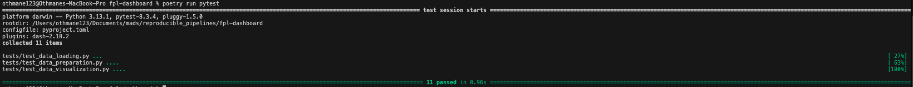
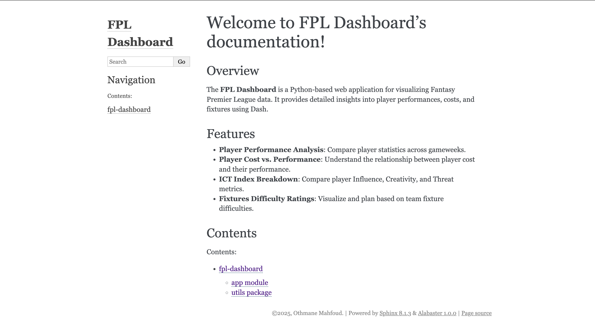
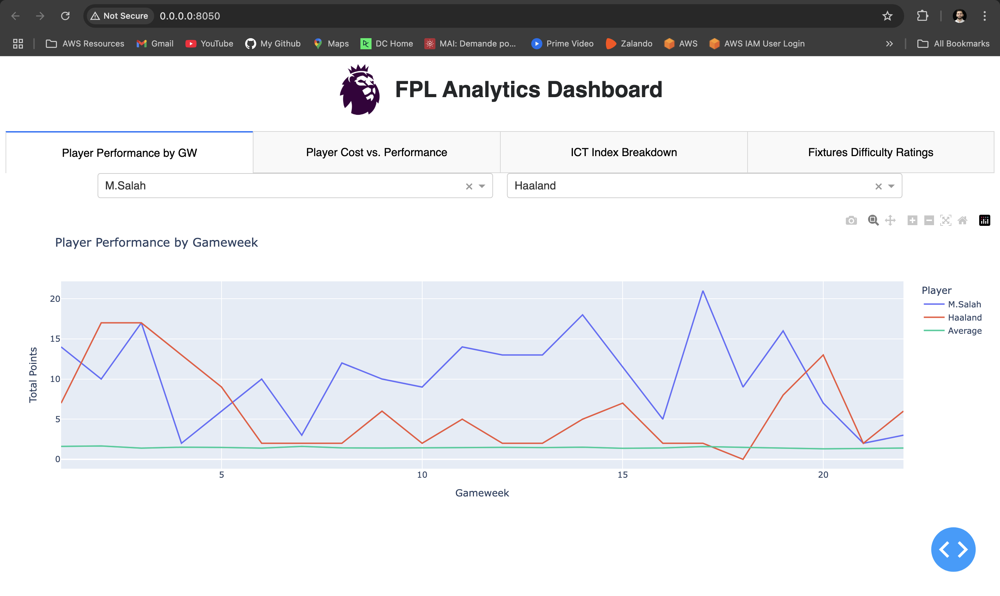
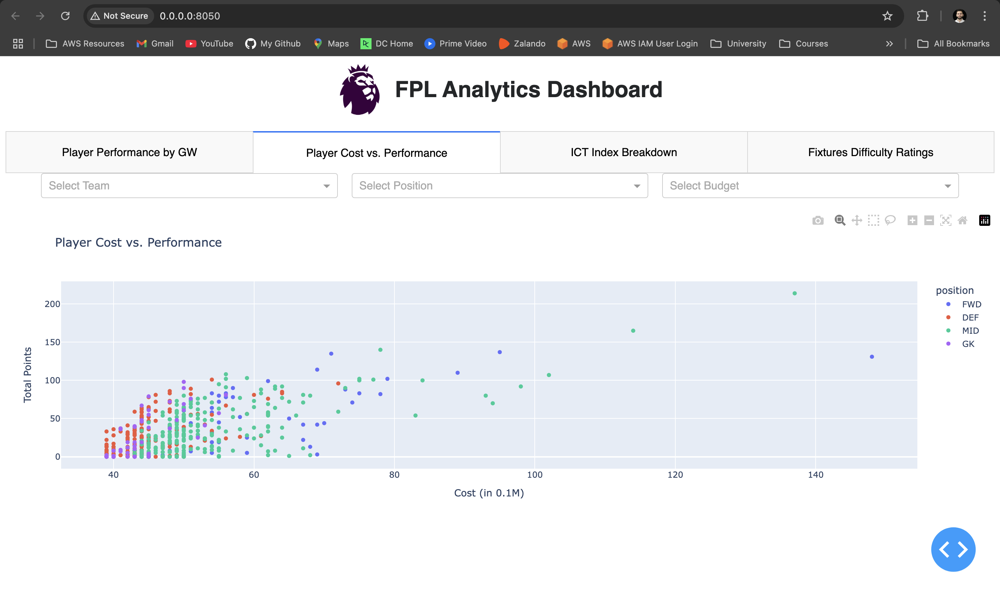
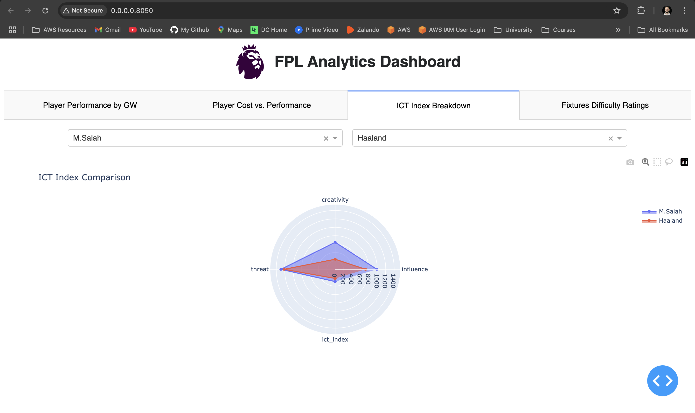
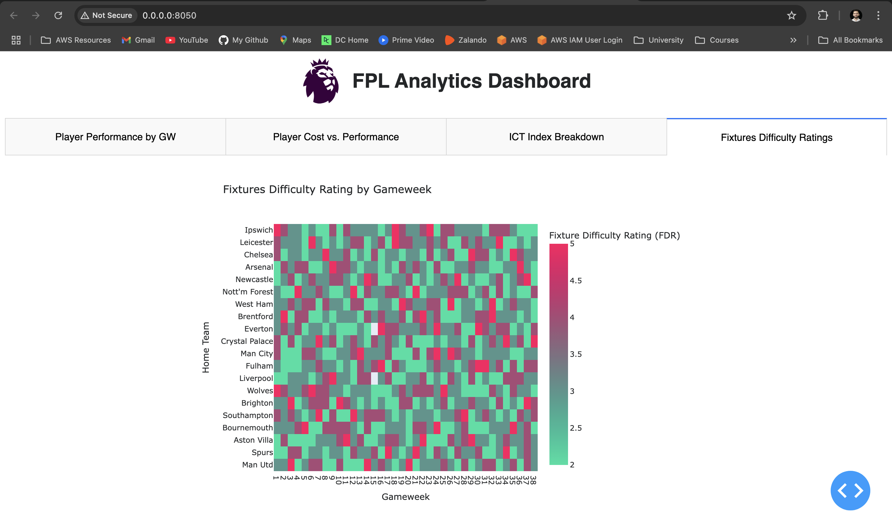

# **FPL Dashboard**

## Overview

The **Fantasy Premier League (FPL) Dashboard** is a web-based analytics application that provides insightful visualizations for Fantasy Premier League players and teams. It allows users to analyze player performances, compare statistics, and evaluate fixture difficulty.

The app is built using **Dash**, with a backend implemented in **Python**, and dependencies managed using **Poetry**. The project is containerized using **Docker** for consistent deployment.

---

## Features

- **Player Performance by Gameweek**: Compare the weekly performances of two players.
- **Player Cost vs. Performance**: Analyze player cost-effectiveness with filtering options (position, team, and budget).
- **ICT Index Breakdown**: Compare influence, creativity, and threat (ICT) values for two players via a radar chart.
- **Fixture Difficulty Ratings**: Visualize and compare the difficulty of fixtures for teams by gameweeks using a heatmap.
---      

## Repository Structure

- `assets/`: Stores all the images and styles used by the app and README.
- `data/`: Contains the csv data files obtained from the FPL API using the `data_loading.py` script.
- `docs/`: Where all the Sphinx documentation scripts and files are stored.
- `tests/`: Contains unit tests for main functions in utils.
- `utils/`: Contains all the helper scripts for data loading, preparation and visualization.
- `app.py`: Main entry point of the app, creates a dashboard visualizing FPL data using Dash and Plotly.
- `Dockerfile` and `.dockerignore`: to ensure reproducibility in any machine using Docker.

## Getting Started

### Prerequisites

- Python ≥ 3.10
- Poetry ≥ 1.6
- Docker ≥ 20.10.0

### Installation

1. **Clone the Repository**
```bash
git clone https://github.com/othmane-mahfoud/fpl-dashboard.git
cd fpl-dashboard
```

### Run Using Docker

1. **Build the Docker Image**
```bash
docker build -t fpl-dashboard .
```

2. **Run the Docker Container**
```bash
docker run -p 8050:8050 fpl-dashboard
```

3. **Access the Dashboard** Open your browser and navigate to: [http://localhost:8050/](http://localhost:8050/)

⚠️ **Note for Safari/Brave Users**  
When using Safari or some other browsers, ensure you access the app via `http://localhost:8050` instead of `http://0.0.0.0:8050`, as they may not handle `0.0.0.0` correctly.

### Run Using Poetry

#### Poetry Installation

Before running the script with Poetry you need to ensure a proper installation of Poetry on your achine

1. **Download and Install Poetry** 

- On Linux, macOS, Windows (WSL): <br>
```bash
curl -sSL https://install.python-poetry.org | python3 -
```

- On Windows (Powershell): <br>
```bash
(Invoke-WebRequest -Uri https://install.python-poetry.org -UseBasicParsing).Content | py -
```

2. **Verify the installation**
```bash
poetry --version
```
You should get a similar output to this: `Poetry version 1.6.1`

#### Run the app

1. **Install Dependencies** Use Poetry to install dependencies:
```bash
poetry install
```

2. **Run the Application**
```bash
poetry run python app.py
```

3. **Access the Dashboard** Open your browser and navigate to: [http://localhost:8050/](http://localhost:8050/)

⚠️ **Note for Safari/Brave Users**  
When using Safari or some other browsers, ensure you access the app via `http://localhost:8050` instead of `http://0.0.0.0:8050`, as they may not handle `0.0.0.0` correctly.

## Testing

Unit tests are implemented using **PyTest**.

1. **Testing with Docker**
```bash
docker run fpl-dashboard poetry run pytest
```

2. **Testing with Poetry**
```bash
poetry run pytest
```

#### Expected Output


## Documentation

Project documentation is already generated using **Sphinx** and can be found in the `docs/` directory.

1. You can **View Documentation** directly in your browser by opening `docs/build/html/index.html` or running the command:
```bash
open docs/build/html/index.html
```

#### Expected Output



### (Optional) Rebuild the documentation

1. **Build Documentation** using `sphinx` (make sure you are in the root directory of the project)
```bash
poetry run sphinx-apidoc -o docs/source .
```

2. **Change directories** and move to the `/docs` folder
```bash
cd docs
```

3. **Generate the documentation** in HTML 
```bash
poetry run make html
```

2. **View Documentation** Open the generated HTML in your browser: `docs/_build/index.html`
```bash
open build/html/index.html
```


## Results

Below are some screenshots from the running app.

### Player Performance Comparison by Gameweek


### Player Cost vs. Performance


### ICT Index Breakdown


### Fixtures Difficulty Rating


## Author

Othmane Mahfoud <br>
Master in Data Science at University of Luxembourg <br>
Feel free to reach out: `mahfoud.othmane97@gmail.com`
